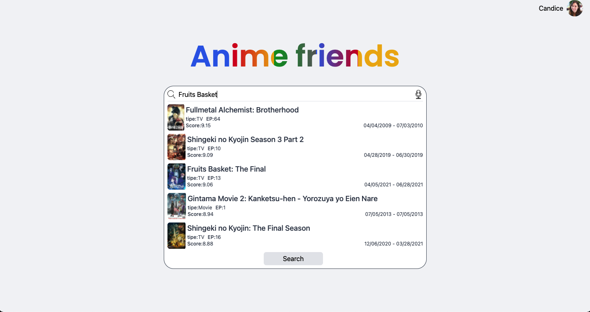
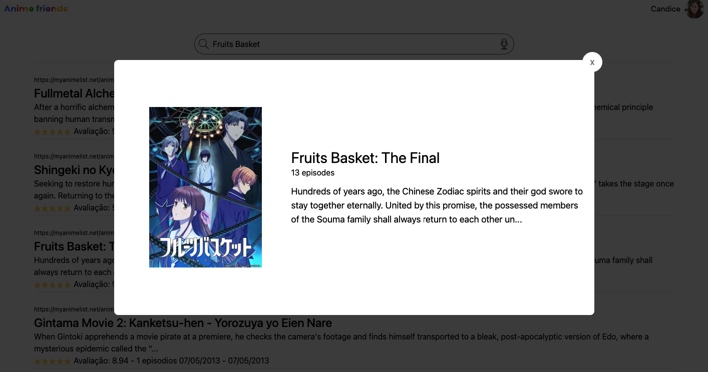

# Projeto Anime Friends

 
 

 
 

## 1. Apresentação

<h3> Este projeto foi desenvolvido em Vue 3, Vuex, Tailwind and SpeechRecognition API. </h3>

 
 

## 2. Objetivo

<h3> O objetivo deste projeto é poder pesquisar animes! </h3>

 
 

## 3. Funcionalidades

<h3> Você pode digitar ou falar qual o anime que você está procurando, assim que clicar em procurar, ele irá trazer diversos resultados referentes ao anime, clicando em cima desses resultados você poderá ver:

 

> Nome do anime;

> Quantidade de episódios;

> Breve resumo.

 
 

 
 

 
 
